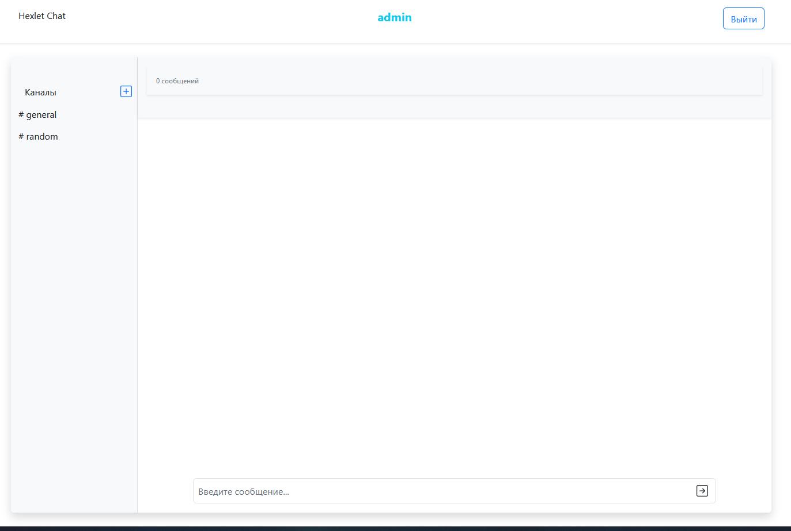

### Hexlet tests and linter status:
[](https://github.com/Lugonue/frontend-project-12/actions)


## Project Name
- Hexlet-chat (slack like)

Table of Contents
Include a table of contents to make it easy for users to navigate your README file.

Installation
Usage
Features


### Installation

```
make install    # install deps
make start      # start server and front of app
```


### Usage

Main page looks like :

 

Features:

- login chat
- sign-up
- write msg in channel
- add channel
- rename channel
- remove channel
- get notification

Tech steck:
- React
- Redux-toolkit
- websockets
- Formik
- axios
- REST